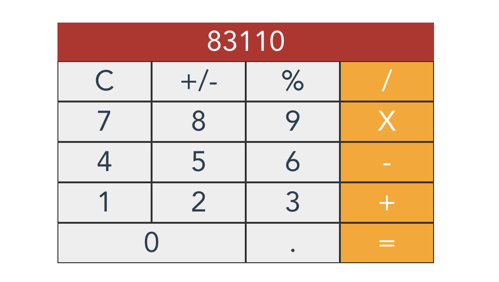

# secondapp
A super duper simple, but fully functional, calculator app mimicking the style of a mac calculator for macOS Sierra. This project was made to learn about the vue.js framework and make a fun sample project.

## Screenshot of the Calculator App



---

### Project setup
```
npm install
```

### Compiles and hot-reloads for development
```
npm run serve
```

### Compiles and minifies for production
```
npm run build
```

### Run your tests
```
npm run test
```

### Lints and fixes files
```
npm run lint
```

### Customize configuration
See [Configuration Reference](https://cli.vuejs.org/config/).
